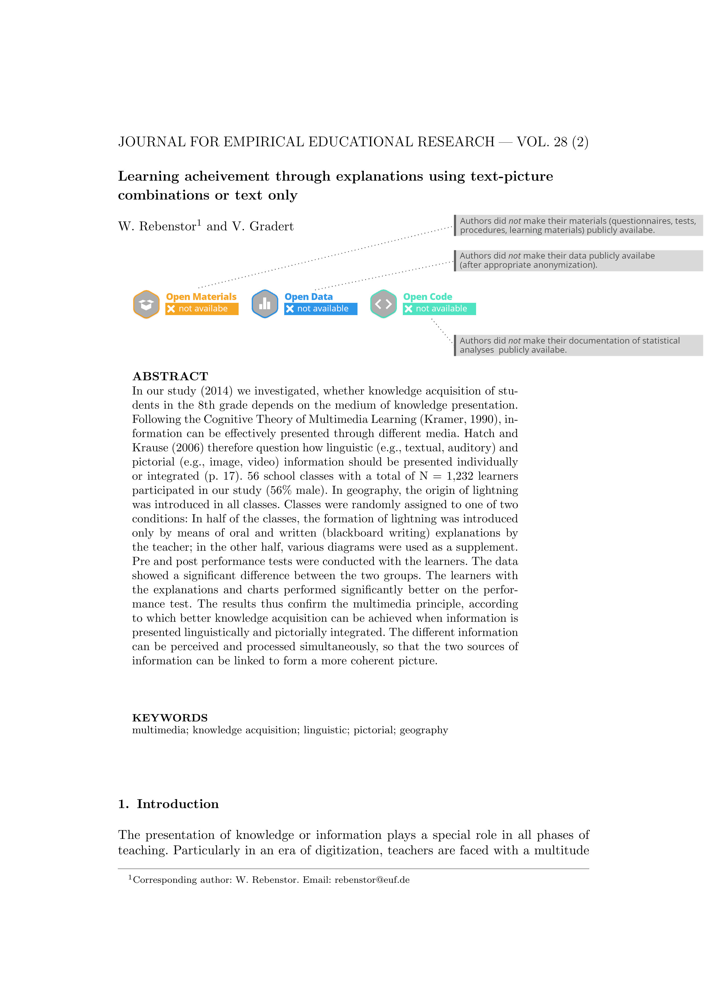
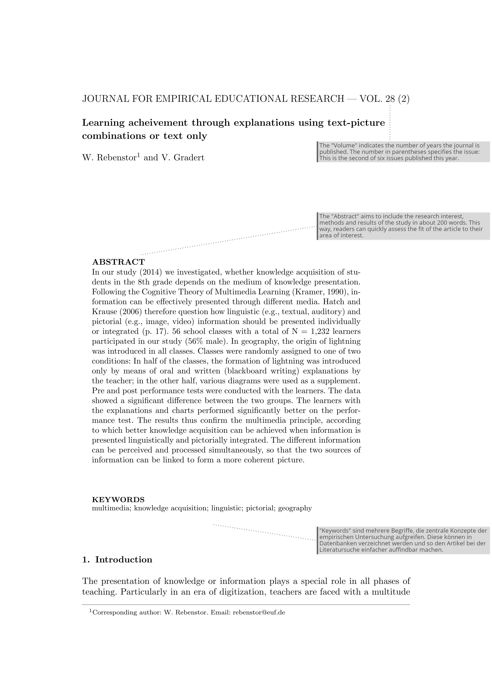
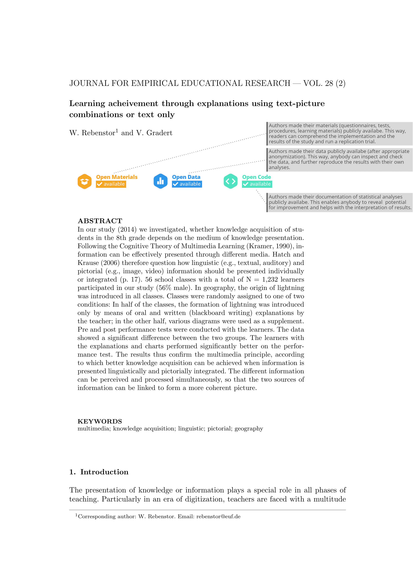
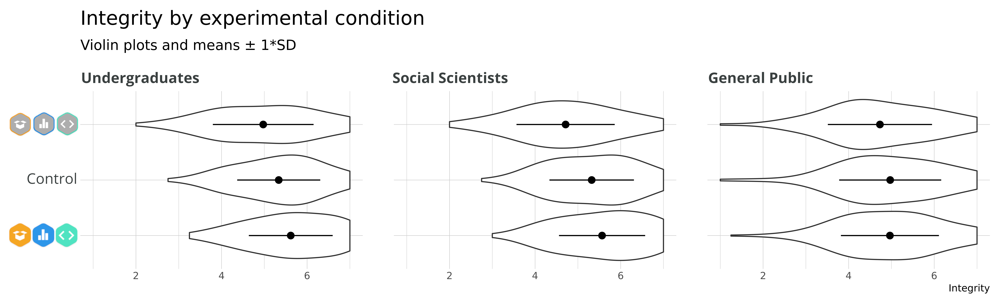
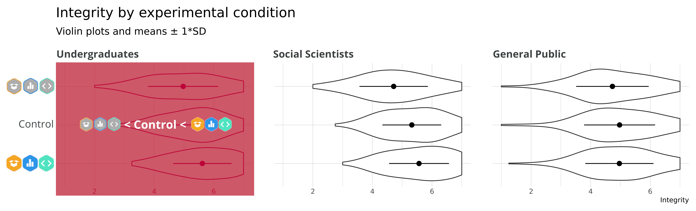
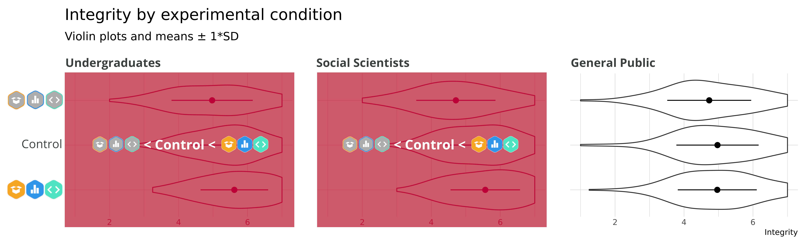
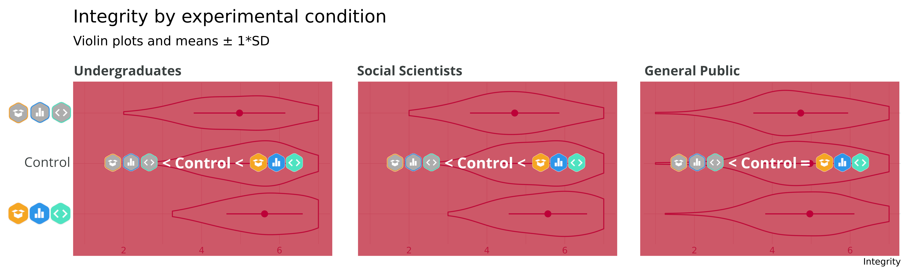
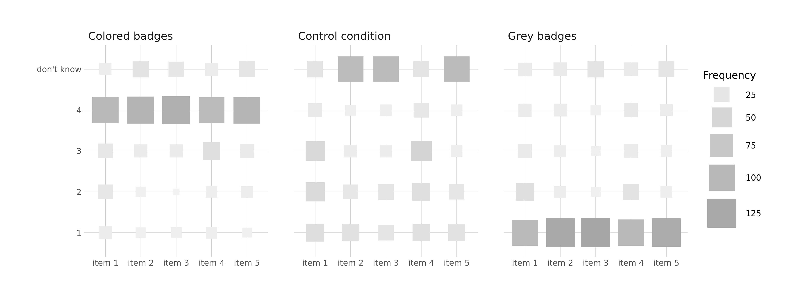
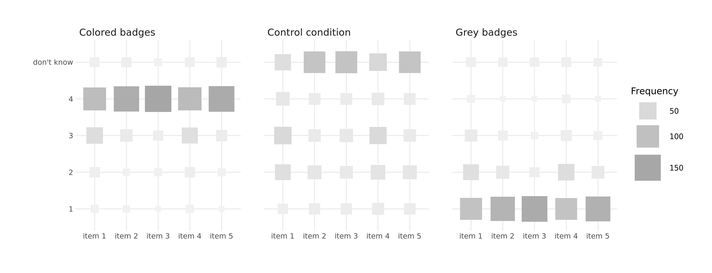
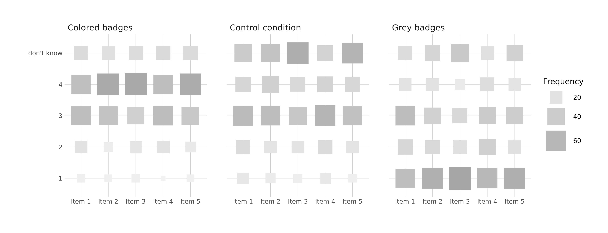

<style>
slides > slide:not(.nobackground):after {
  content: '';
}
</style>


```{r setup, include=FALSE}
knitr::opts_chunk$set(echo = FALSE)
# download.file("https://drive.google.com/uc?export=download&id=1wuMqL_Z8T9rxuGvn0VP6siag90kHDm2O",
#               "../www/references.bib", overwrite = T)

library(fontawesome)
```

## Why | <span style="background-color: rgba(1, 0, 40, 0.7)">investigating badges and trust</span>


* detrimental effect of __replication crisis__ on perceived __trustworthiness__ <span class="mysource">[@anvarietal.2018; @wingenetal.2020]</span><br /><br /><br />
* community: increase __transparency__ and __reproducibility__ <span class="mysource">[@lindsay.2015; @vazire.2018]</span><br /><br /><br />


<div class="myfooter">
  _preprint_  [bit.ly/OS-Badges](https://doi.org/10.31234/osf.io/43ec2) &nbsp;&nbsp;&nbsp; __|__ &nbsp;&nbsp;&nbsp; _slides_  [bit.ly/meta-slides](https://gitlab.com/j_5chneider/re-building-trust/-/raw/master/6_dissemination/MetascienceConference_2021-09-24.html?inline=false) &nbsp;&nbsp;&nbsp; __|__ &nbsp;&nbsp;&nbsp; `r fa(name = "twitter")` artzyatfailing2
</div>


## Why | <span style="background-color: rgba(1, 0, 40, 0.7)">investigating badges and trust</span>


* detrimental effect of __replication crisis__ on perceived __trustworthiness__ <span class="mysource">[@anvarietal.2018; @wingenetal.2020]</span><br /><br /><br />
* community: increase __transparency__ and __reproducibility__ <span class="mysource">[@lindsay.2015; @vazire.2018]</span><br /><br /><br />
* journals: __badges__ to signal adherence to open science practices (OSP)<span class="mysource">(list see https://www.cos.io/initiatives/badges)</span><br /><br /><br />
* effectiveness to foster the __implementation__ of OSP <span class="mysource">[@kidwelletal.2016]</span><br /><br /><br /><br />

<div class="myfooter">
  _preprint_  [bit.ly/OS-Badges](https://doi.org/10.31234/osf.io/43ec2) &nbsp;&nbsp;&nbsp; __|__ &nbsp;&nbsp;&nbsp; _slides_  [bit.ly/meta-slides](https://gitlab.com/j_5chneider/re-building-trust/-/raw/master/6_dissemination/MetascienceConference_2021-09-24.html?inline=false) &nbsp;&nbsp;&nbsp; __|__ &nbsp;&nbsp;&nbsp; `r fa(name = "twitter")` artzyatfailing2
</div>


## Why | <span style="background-color: rgba(1, 0, 40, 0.7)">investigating badges and trust</span>


* detrimental effect of __replication crisis__ on perceived __trustworthiness__ <span class="mysource">[@anvarietal.2018; @wingenetal.2020]</span><br /><br /><br />
* community: increase __transparency__ and __reproducibility__ <span class="mysource">[@lindsay.2015; @vazire.2018]</span><br /><br /><br />
* journals: __badges__ to signal adherence to open science practices (OSP)<span class="mysource">(list see https://www.cos.io/initiatives/badges)</span><br /><br /><br />
* effectiveness to foster the __implementation__ of OSP <span class="mysource">[@kidwelletal.2016]</span><br /><br /><br />

<p style="text-align: center">
<span style="background-color: rgba(198, 0, 59, 0.7);">&nbsp; `r fa(name = "caret-square-right")` not much is known on the effects of badges at an individual level such as trust &nbsp;</span>
</p>

<div class="myfooter">
  _preprint_  [bit.ly/OS-Badges](https://doi.org/10.31234/osf.io/43ec2) &nbsp;&nbsp;&nbsp; __|__ &nbsp;&nbsp;&nbsp; _slides_  [bit.ly/meta-slides](https://gitlab.com/j_5chneider/re-building-trust/-/raw/master/6_dissemination/MetascienceConference_2021-09-24.html?inline=false) &nbsp;&nbsp;&nbsp; __|__ &nbsp;&nbsp;&nbsp; `r fa(name = "twitter")` artzyatfailing2
</div>


## Method

<div class="container">

<div class="box32">

</div>

<div class="box32">

</div>

<div class="box32">

</div>

</div>


<div class="myfooter">
  _preprint_  [bit.ly/OS-Badges](https://doi.org/10.31234/osf.io/43ec2) &nbsp;&nbsp;&nbsp; __|__ &nbsp;&nbsp;&nbsp; _slides_  [bit.ly/meta-slides](https://gitlab.com/j_5chneider/re-building-trust/-/raw/master/6_dissemination/MetascienceConference_2021-09-24.html?inline=false) &nbsp;&nbsp;&nbsp; __|__ &nbsp;&nbsp;&nbsp; `r fa(name = "twitter")` artzyatfailing2
</div>


## Method | Samples

* __Study 1: Undergraduates (pre-service teachers)__
   + $N$ = 270
   + age: $M$ = 22.9 (3.0); semester: $M$ = 5.9 (3.7)<br /><br />
* __Study 2: Social Scientists__
   + $N$ = 250
   + position: $Mo$ = graduate research assistant or postgraduate researcher; <br />age: $Mo$ = younger than 35 years<br /><br />
* __Study 3: General Public (UK)__
   + $N$ = 257
   + cross quota (based on census) of sex, age, qualification
   
<div class="myfooter">
  _preprint_  [bit.ly/OS-Badges](https://doi.org/10.31234/osf.io/43ec2) &nbsp;&nbsp;&nbsp; __|__ &nbsp;&nbsp;&nbsp; _slides_  [bit.ly/meta-slides](https://gitlab.com/j_5chneider/re-building-trust/-/raw/master/6_dissemination/MetascienceConference_2021-09-24.html?inline=false) &nbsp;&nbsp;&nbsp; __|__ &nbsp;&nbsp;&nbsp; `r fa(name = "twitter")` artzyatfailing2
</div>


## Method | <span style="background-color: rgba(1, 0, 40, 0.7)">Measures & Analyses</span>

\

__Measures:__  
Integrity subscale of epistemic trust <span class="mysource">[@hendriksetal.2015]</span>  
$\omega$ = .83-.92

\
\

__Preregistered:__  
  
approximate adjusted fractional Bayes factors <span class="mysource">[@guetal.2018; @hoijtinketal.2019]</span>

<div class="myfooter">
  _preprint_  [bit.ly/OS-Badges](https://doi.org/10.31234/osf.io/43ec2) &nbsp;&nbsp;&nbsp; __|__ &nbsp;&nbsp;&nbsp; _slides_  [bit.ly/meta-slides](https://gitlab.com/j_5chneider/re-building-trust/-/raw/master/6_dissemination/MetascienceConference_2021-09-24.html?inline=false) &nbsp;&nbsp;&nbsp; __|__ &nbsp;&nbsp;&nbsp; `r fa(name = "twitter")` artzyatfailing2
</div>


## Results

<br /><br />



<div class="notes">
These are some notes only visible in the presenter mode.
Add ?presentme=true behind the URL (e.g. my-presentation.html?presentme=true)
and (amybe) press p
</div>

<div class="myfooter">
  _preprint_  [bit.ly/OS-Badges](https://doi.org/10.31234/osf.io/43ec2) &nbsp;&nbsp;&nbsp; __|__ &nbsp;&nbsp;&nbsp; _slides_  [bit.ly/meta-slides](https://gitlab.com/j_5chneider/re-building-trust/-/raw/master/6_dissemination/MetascienceConference_2021-09-24.html?inline=false) &nbsp;&nbsp;&nbsp; __|__ &nbsp;&nbsp;&nbsp; `r fa(name = "twitter")` artzyatfailing2
</div>


## Results

<br /><br />
  
  
BF against $H_0 = 3.5*10^7$, $H_2 = 4.5*10^1$, $\overline{H_1} = 4.8*10^3$, $H_u = 5.5$  
$d_{GB/CC} = .32$, $d_{CC/CB} = .29$, $d_{GB/CB} = .57$

<div class="myfooter">
  _preprint_  [bit.ly/OS-Badges](https://doi.org/10.31234/osf.io/43ec2) &nbsp;&nbsp;&nbsp; __|__ &nbsp;&nbsp;&nbsp; _slides_  [bit.ly/meta-slides](https://gitlab.com/j_5chneider/re-building-trust/-/raw/master/6_dissemination/MetascienceConference_2021-09-24.html?inline=false) &nbsp;&nbsp;&nbsp; __|__ &nbsp;&nbsp;&nbsp; `r fa(name = "twitter")` artzyatfailing2
</div>


## Results

<br /><br />
  
  
BF against $H_0 = 1.6*10^{11}$, $H_2 = 7.5$, $\overline{H_1} = 8.0*10^2$, $H_u = 5.4$  
$d_{GB/CC} = .55$, $d_{CC/CB} = .25$, $d_{GB/CB} = .77$


<div class="myfooter">
  _preprint_  [bit.ly/OS-Badges](https://doi.org/10.31234/osf.io/43ec2) &nbsp;&nbsp;&nbsp; __|__ &nbsp;&nbsp;&nbsp; _slides_  [bit.ly/meta-slides](https://gitlab.com/j_5chneider/re-building-trust/-/raw/master/6_dissemination/MetascienceConference_2021-09-24.html?inline=false) &nbsp;&nbsp;&nbsp; __|__ &nbsp;&nbsp;&nbsp; `r fa(name = "twitter")` artzyatfailing2
</div>


## Results

<br /><br />
  
  
BF against $H_0 = 3.2$, $H_1 = 5.8$, $\overline{H_2} = 18.5$, $H_u = 18.5$  
$d_{GB/CC} = .21$, $d_{CC/CB} = -.02$, $d_{GB/CB} = .20$


<div class="myfooter">
  _preprint_  [bit.ly/OS-Badges](https://doi.org/10.31234/osf.io/43ec2) &nbsp;&nbsp;&nbsp; __|__ &nbsp;&nbsp;&nbsp; _slides_  [bit.ly/meta-slides](https://gitlab.com/j_5chneider/re-building-trust/-/raw/master/6_dissemination/MetascienceConference_2021-09-24.html?inline=false) &nbsp;&nbsp;&nbsp; __|__ &nbsp;&nbsp;&nbsp; `r fa(name = "twitter")` artzyatfailing2
</div>


# Thank you 
<div style="position:absolute; top:15%; left:60%; width:30%">{width=100%}</div>

__Jürgen Schneider__  
  
juergen.schneider@uni-tuebingen.de  
  
[ORCID: 0000-0002-3772-4198](https://orcid.org/0000-0002-3772-4198)


<div class="myfooter">
  _preprint_  [bit.ly/OS-Badges](https://doi.org/10.31234/osf.io/43ec2) &nbsp;&nbsp;&nbsp; __|__ &nbsp;&nbsp;&nbsp; _slides_  [bit.ly/meta-slides](https://gitlab.com/j_5chneider/re-building-trust/-/raw/master/6_dissemination/MetascienceConference_2021-09-24.html?inline=false) &nbsp;&nbsp;&nbsp; __|__ &nbsp;&nbsp;&nbsp; `r fa(name = "twitter")` artzyatfailing2
</div>

## tools used

* [formr](https://formr.org)
* [badges](https://curatescience.org/app/help) CC-BY-SA


# {.refs}

<div id = "refs"></div>

# Additional slides

## Treatment Check | Study 1


## Treatment Check | Study 2


## Treatment Check | Study 3
