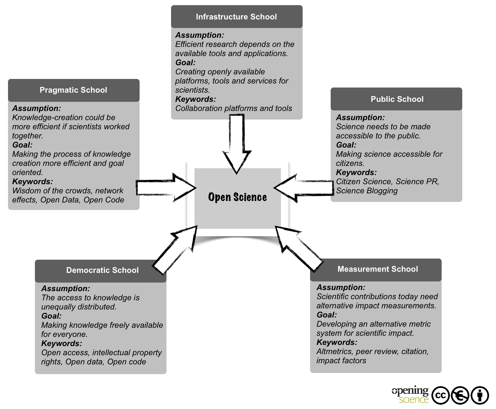

<style>
slides > slide:not(.nobackground):after {
  content: '';
}
</style>


```{r setup, include=FALSE}
knitr::opts_chunk$set(echo = FALSE)
# download.file("https://drive.google.com/uc?export=download&id=1wuMqL_Z8T9rxuGvn0VP6siag90kHDm2O",
#               "../www/references.bib", overwrite = T)

library(fontawesome)
```


## Examples | icon, reference, footer

\
\

`r fa(name = "long-arrow-alt-right")` this is a scientific claim<span class="mysource">[@opensciencecollaboration.2015; @lupia.2018]</span>


<div class="myfooter">
  slides:  [osf.io/b5vnh/](https://osf.io/b5vnh/)   `r fa(name = "twitter")` artzyatfailing2
</div>


## CSS color background {data-background=#ff0000}

## Full size image background {data-background="www/cm_visOSP_poster.png"}

## Video background {data-background-video="www/background.mp4"}

## A background page {data-background-iframe="https://example.com"}


## &nbsp;



<div style="opacity: .6; font-size: .7em; margin-top:57%; margin-left:8%">[@fecheretal.2014]</div>


## 60% / 30% and presenter notes

<div class="container">

<div class="box60c">
This is 60% and centered.
</div>

<div class="box30c">
This is 30% and centered.
</div>

</div>

<div class="notes">
These are some notes only visible in the presenter mode.
Add ?presentme=true behind the URL (e.g. my-presentation.html?presentme=true)
and (amybe) press p
</div>

# Thank you 

__Jürgen Schneider__  
  
juergen.schneider@uni-tuebingen.de  
07071-29 76088  
[ORCID: 0000-0002-3772-4198](https://orcid.org/0000-0002-3772-4198)


_with_  
__Samuel Merk__  
__Tom Rosman__  
__Augustin Kelava__
  
_cooperation_  
__Leibniz Institute for Psychology Information__

## tools used

* [formr](https://formr.org)
* [flex_dashboard](https://rmarkdown.rstudio.com/flexdashboard/)
* [badges](https://curatescience.org/app/help) CC-BY-SA

# Pictures


__title page__ | [Thomas Kinto](https://unsplash.com/@thomaskinto) on [Unsplash](https://unsplash.com)  


# {.refs}

