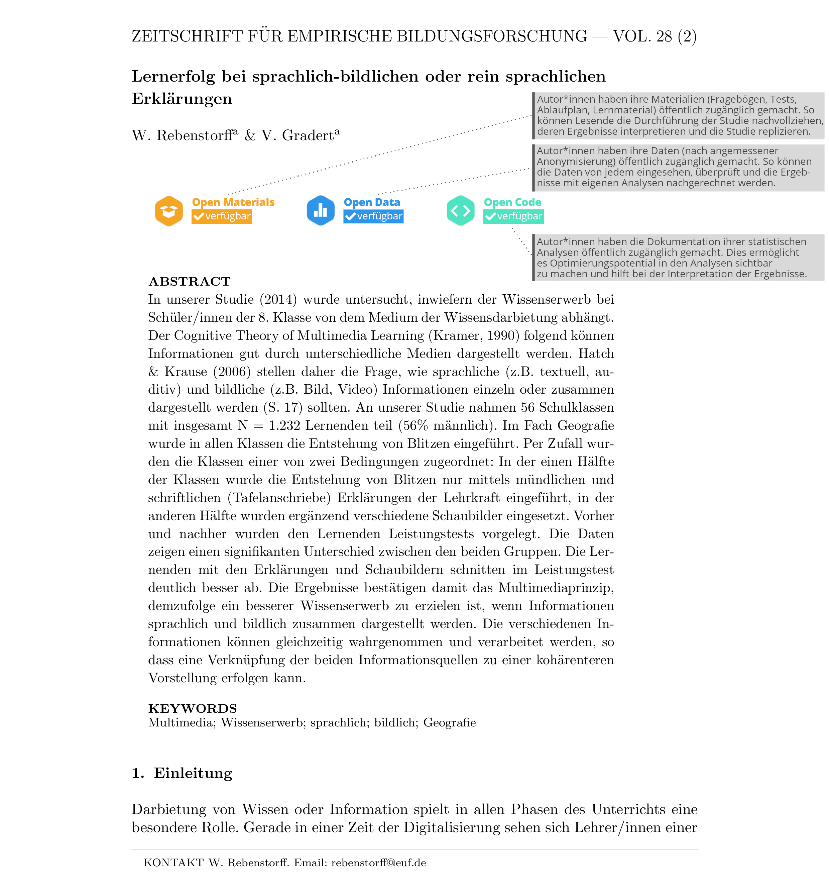

<style>
slides > slide:not(.nobackground):after {
  content: '';
}
</style>


```{r setup, include=FALSE}
knitr::opts_chunk$set(echo = FALSE)
# download.file("https://drive.google.com/uc?export=download&id=1wuMqL_Z8T9rxuGvn0VP6siag90kHDm2O", 
#               "../www/references.bib", overwrite = T)

library(shiny)

```


## Replication Crisis 

\
\

`r icon(name = "arrow-alt-circle-down", lib = "font-awesome")` Replication crisis diminishes trust in empirical research <span class="mysource">[@opensciencecollaborationEstimatingReproducibilityPsychological2015; @lupiaRoleTransparencyMaintaining2018; @chopiketal2018.How]</span>


<div class="myfooter">
  slides:  [osf.io/b5vnh/](https://osf.io/b5vnh/)   `r icon(name = "twitter", lib = "font-awesome")` artzyatfailing2
</div>


## &nbsp;


<div style="opacity: .6; font-size: .7em; margin-top:57%; margin-left:8%">[@fecherOpenScienceOne2014]</div>


## Replication Crisis 

\
\

`r icon(name = "arrow-alt-circle-down", lib = "font-awesome")` Replication crisis diminishes trust in empirical research <span class="mysource">[@opensciencecollaborationEstimatingReproducibilityPsychological2015; @lupiaRoleTransparencyMaintaining2018; @chopiketal2018.How]</span>

\
  
`r icon(name = "lock-open", lib = "font-awesome")` Openness & science communication: (re)built trust <span class="mysource">[@fecherOpenScienceOne2014]</span>

\
  
`r icon(name = "star", lib = "font-awesome")` Particularly significant within professions that include reflections on evidence-based actions

<div class="myfooter">
  slides:  [osf.io/b5vnh/](https://osf.io/b5vnh/)   `r icon(name = "twitter", lib = "font-awesome")` artzyatfailing2
</div>


## Open Science & Perceived Trustworthiness | Current Research

__[@wingenNoReplicationNo2019]__

* learning about replication crisis diminishes trust in psychological research
* learning about reforms does _not_ help to rebuilt trust

\

__[@anvarietal.2019]__

* learning about replication crisis (and QRP) diminishes trust in _past_ psychological research
* learning about reforms additionally reduces trust in _future_ psychological research

<div class="myfooter">
  slides:  [osf.io/b5vnh/](https://osf.io/b5vnh/)   `r icon(name = "twitter", lib = "font-awesome")` artzyatfailing2
</div>

## Open Science & Perceived Trustworthiness | Shifting the Focus

descriptions of reforms `r icon(name = "long-arrow-alt-right", lib = "font-awesome")` visible OSP in journal articles ("badges")

<div class="myfooter">
  slides:  [osf.io/b5vnh/](https://osf.io/b5vnh/)   `r icon(name = "twitter", lib = "font-awesome")` artzyatfailing2
</div>

## &nbsp;



## &nbsp;


## &nbsp;


## Current Study | Design


<div class="box45r" style="margin-left:70%; margin-top:15%">
__rotations__

  * order of treatment
  * order of topic
</div>

<div class="myfooter">
  slides:  [osf.io/b5vnh/](https://osf.io/b5vnh/)   `r icon(name = "twitter", lib = "font-awesome")` artzyatfailing2
</div>

## Current Study | Measures


* __perceived trustworthiness__ (subscale integrity) <span class="mysource">[@hendriksMeasuringLaypeopleTrust2015]</span>
  * semantic differential: 7-point scale
  * sample item: _honest_ - _dishonest_ 
* __treatment check__
  * likert: 4-point scale
  * sample item: _Used materials and collected data in this study are publicly available._

\

* Preregistered Hypotheses ([osf.io/2zypf](https://osf.io/2zypf)):
    * perceived integrity: nonOSP `r icon(name = "angle-left", lib = "font-awesome")` nonvis `r icon(name = "angle-left", lib = "font-awesome")` visOSP
    * (topic specific) multiplistic epistemic beliefs `r icon(name = "arrows-alt-h", lib = "font-awesome")` perceived integrity

<div class="myfooter">
  slides:  [osf.io/b5vnh/](https://osf.io/b5vnh/)   `r icon(name = "twitter", lib = "font-awesome")` artzyatfailing2
</div>

## Current Study | Sample & Analyses


* Sample
  * BFDA: N= 220 participants
  * pre-service teachers
* Analyses: Informative Hypotheses Approach `bain` <span class="mysource">[@guBainBayesFactors2019]</span>

<div class="myfooter">
  slides:  [osf.io/b5vnh/](https://osf.io/b5vnh/)   `r icon(name = "twitter", lib = "font-awesome")` artzyatfailing2
</div>

# Dashboard 

# Thank you 

__Jürgen Schneider__  
  
juergen.schneider@uni-tuebingen.de  
07071-29 76088  
[ORCID: 0000-0002-3772-4198](https://orcid.org/0000-0002-3772-4198)


_with_  
__Samuel Merk__  
__Tom Rosman__
  
_cooperation_  
__Leibniz Institute for Psychology Information__

## tools used

* [formr](https://formr.org)
* [flex_dashboard](https://rmarkdown.rstudio.com/flexdashboard/)
* [badges](https://curatescience.org/app/help) CC-BY-SA

# Pictures


__title page__ | [Thomas Kinto](https://unsplash.com/@thomaskinto) on [Unsplash](https://unsplash.com)  


# {.myref}

