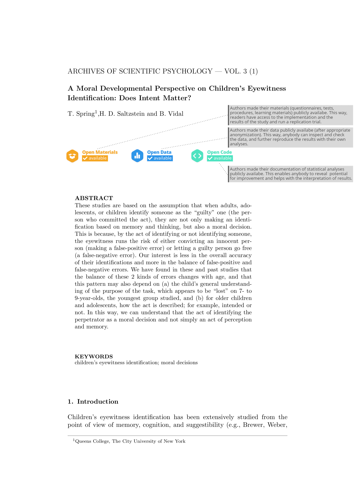
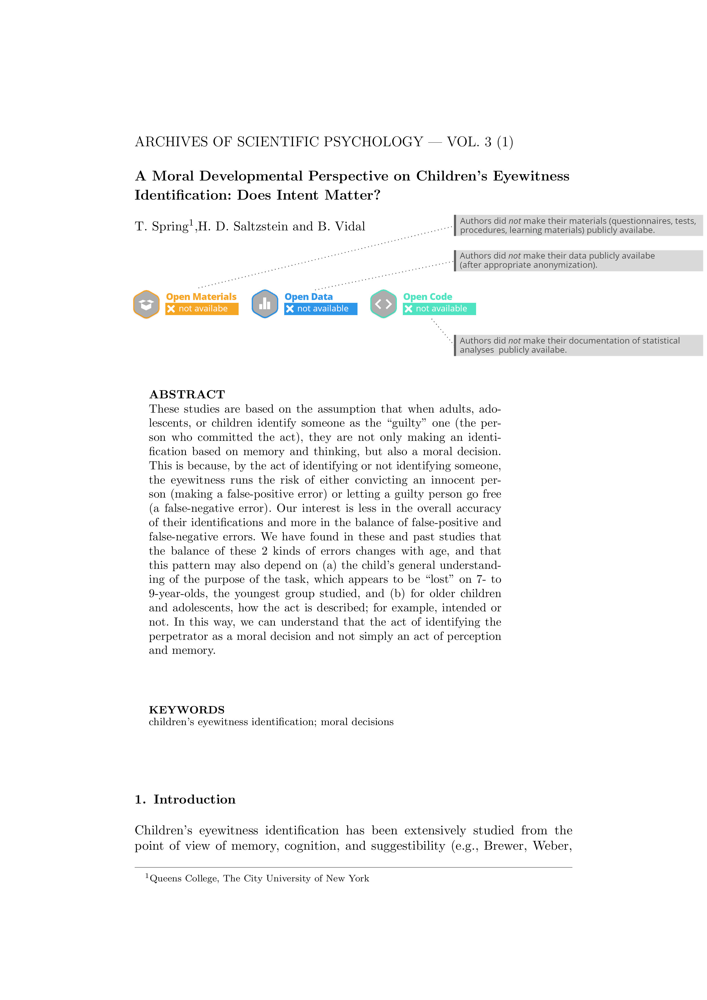
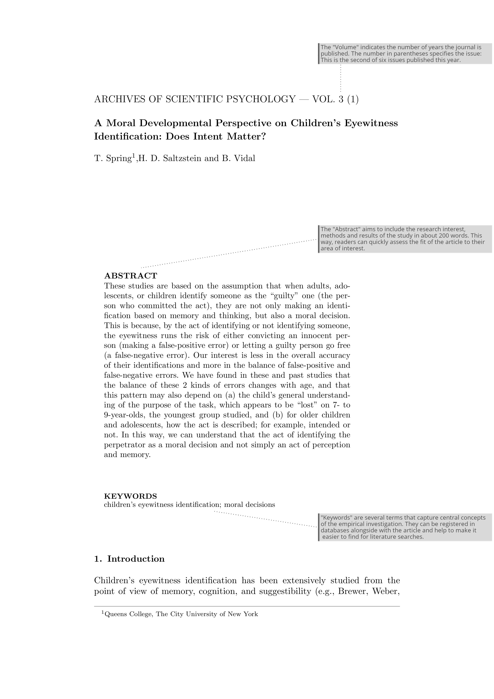
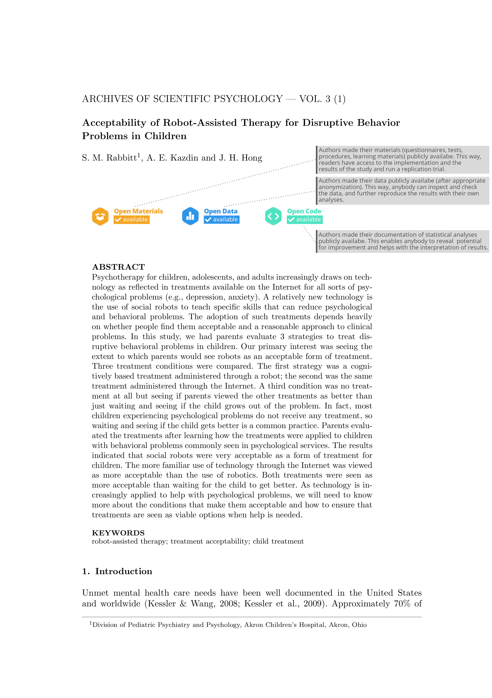
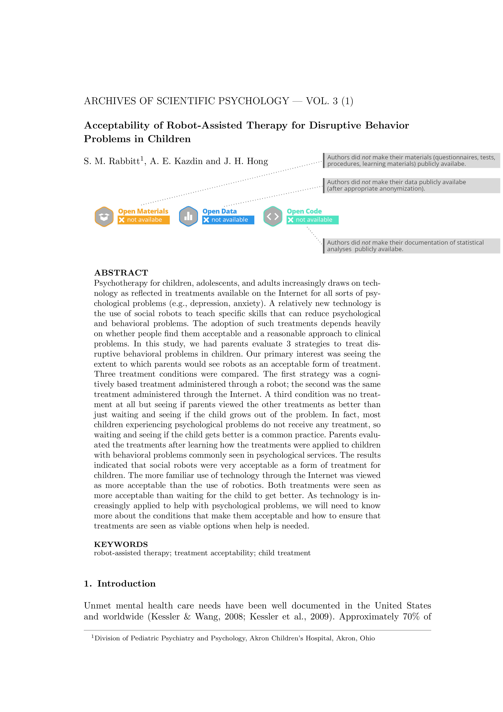
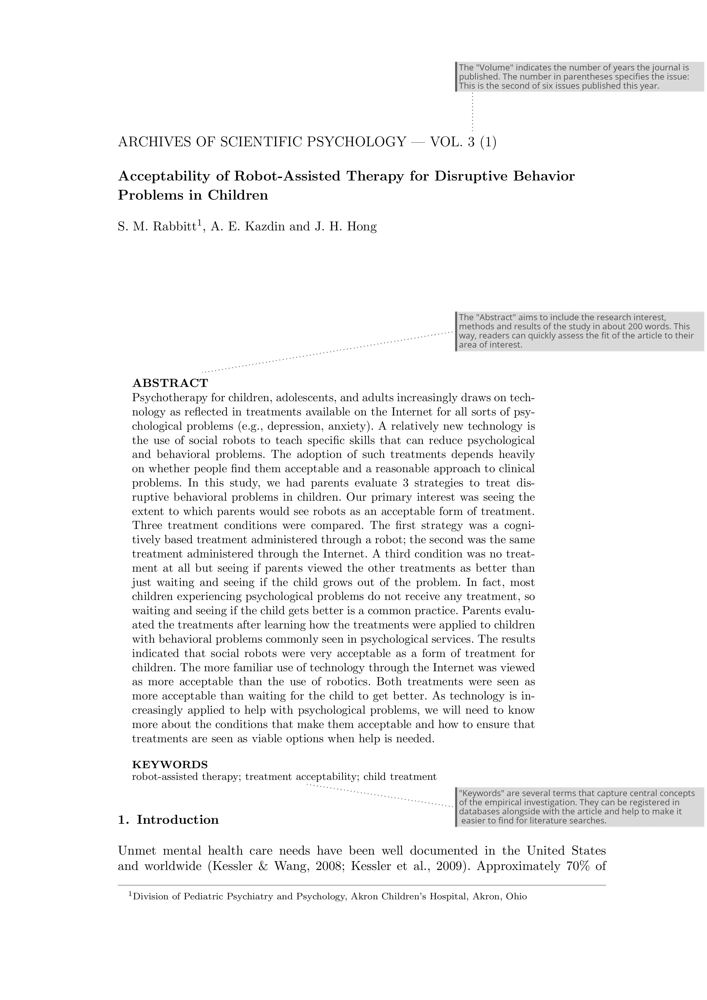

```{r setup, include=FALSE}
knitr::opts_chunk$set(echo = TRUE,  dev = "cairo_pdf")
library(dplyr)
library(kableExtra)
# download.file("https://drive.google.com/uc?export=download&id=1wuMqL_Z8T9rxuGvn0VP6siag90kHDm2O",
#               "../../www/references.bib", overwrite = T)
```


# Study Information

## Title
(Re)Building Trust. Investigating the effects of open science badges on perceived trustworthiness of journal articles. [EXPANSION: Public Sample]


## Description
This study is an expansion to [@schneideretal.2020a], in which we investigated the effects of open science badges in journal articles on trust in scientists. Since college students are a population that engage with scientific studies on a regular basis, the sample of the first study focused on this population. Among other results, the study revealed an effect of open science badges on trust in scientists.  
  
In two expansion studies we investigate the robustness of the effects over other populations (external validity). This study expands the investigation to include a sample of the public in the United Kingdom.


## Hypotheses

1. Confirmatory, H1: Visible OSP (vs. not visible vs. visibly non-OSP) influence the perceived trustworthiness (subscale integrity). Our assumption: The more openness, the more trustworthy with small to moderate effects:  $\mu_1 < \mu_2 < \mu_3$. With the `bain` [@guetal.2019] package we will evaluate the following informative hypotheses using Bayes factors:  
   1. $\mu_1 < \mu_2 < \mu_3$
   2. $\mu_1 = \mu_2 = \mu_3$
   3. $\mu_1 < \mu_2 = \mu_3$
   4. $\mu_1 , \mu_2 , \mu_3$
2. Confirmatory, H2: The higher the topic specific multiplism, the lower the perceived trustworthiness (subscale integrity). Negative correlation.
3. Exploratory, H3: Topic specific multiplism moderates the effect of OSP on perceived trustworthiness (subscale integrity). 
4. Exploratory, H4: Visible OSP (vs. not visible vs. visibly non-OSP) have a negative effect on topic specific multiplism.

# Design Plan
<!-- In this section, you will be asked to describe the overall design of your study. Remember that this research plan is designed to register a single study, so if you have multiple experimental designs, please complete a separate preregistration. -->


## Study type
_Wording taken from OSF preregistration forms, since they are closed questions:_  

**Experiment**. A researcher randomly assigns treatments to study subjects, this includes field or lab experiments. This is also known as an intervention experiment and includes randomized controlled trials.


## Blinding
<!-- Blinding describes who is aware of the experimental manipulations within a study. Select all that apply. Is there any additional blinding in this study? -->
_Wording taken from OSF preregistration forms, since they are closed questions:_  

* For studies that involve human subjects, they will not know the treatment group to which they have been assigned.
* Personnel who interact directly with the study subjects (either human or non-human subjects) will not be aware of the assigned treatments.


## Study design
<!-- Describe your study design. Examples include two-group, factorial, randomized block, and repeated measures. Is it a between (unpaired), within-subject (paired), or mixed design? Describe any counterbalancing required. Typical study designs for observation studies include cohort, cross sectional, and case-control studies.

This question has a variety of possible answers. The key is for a researcher to be as detailed as is necessary given the specifics of their design. Be careful to determine if every parameter has been specified in the description of the study design. There may be some overlap between this question and the following questions. That is OK, as long as sufficient detail is given in one of the areas to provide all of the requested information. For example, if the study design describes a complete factorial, 2 X 3 design and the treatments and levels are specified previously, you do not have to repeat that information.

Example: We have a between subjects design with 1 factor (sugar by mass) with 4 levels. -->

The design will include three conditions: 

* colored open science badges (CB)
* grayed out open science badges (GB)
* control condition with no badges (CC). 

Two of the (three) conditions are randomly chosen and randomized in their order within person. We use this planned missing design to prevent experimental leakage.  


## Randomization
<!-- If you are doing a randomized study, how will you randomize, and at what level? Typical randomization techniques include: simple, block, stratified, and adaptive covariate randomization. If randomization is required for the study, the method should be specified here, not simply the source of random numbers.

Example: We will use block randomization, where each participant will be randomly assigned to one of the four equally sized, predetermined blocks. The random number list used to create these four blocks will be created using the web applications available at http://random.org. -->

* Randomization 1: Two of the three conditions will be randomly assigned to the participants.
* Randomization 2: The order of presentation will be randomized between the two conditions, within the participant.
* Randomization 3: Within each of the six combinations of randomization 1 & 2, we will randomize the order of the topic. 


# Sampling Plan
<!-- In this section we’ll ask you to describe how you plan to collect samples, as well as the number of samples you plan to collect and your rationale for this decision. Please keep in mind that the data described in this section should be the actual data used for analysis, so if you are using a subset of a larger data set, please describe the subset that will actually be used in your study. -->


## Existing data
<!-- Preregistration is designed to make clear the distinction between confirmatory tests, specified prior to seeing the data, and exploratory analyses conducted after observing the data. Therefore, creating a research plan in which existing data will be used presents unique challenges. Please select the description that best describes your situation. Please do not hesitate to contact us if you have questions about how to answer this question (prereg@cos.io). -->
_Wording taken from OSF preregistration forms, since they are closed questions:_  
**Registration prior to collection of data**


## Explanation of existing data
<!-- If you indicate that you will be using some data that already exist in this study, please describe the steps you have taken to assure that you are unaware of any patterns or summary statistics in the data. This may include an explanation of how access to the data has been limited, who has observed the data, or how you have avoided observing any analysis of the specific data you will use in your study.

An appropriate instance of using existing data would be collecting a sample size much larger than is required for the study, using a small portion of it to conduct exploratory analysis, and then registering one particular analysis that showed promising results. After registration, conduct the specified analysis on that part of the data set that had not been investigated by the researcher up to that point.

Example: An appropriate instance of using existing data would be collecting a sample size much larger than is required for the study, using a small portion of it to conduct exploratory analysis, and then registering one particular analysis that showed promising results. After registration, conduct the specified analysis on that part of the data set that had not been investigated by the researcher up to that point. -->

None.


## Data collection procedures
<!-- Please describe the process by which you will collect your data. If you are using human subjects, this should include the population from which you obtain subjects, recruitment efforts, payment for participation, how subjects will be selected for eligibility from the initial pool (e.g. inclusion and exclusion rules), and your study timeline. For studies that don't include human subjects, include information about how you will collect samples, duration of data gathering efforts, source or location of samples, or batch numbers you will use.

The answer to this question requires a specific set of instructions so that another person could repeat the data collection procedures and recreate the study population. Alternatively, if the study population would be unable to be reproduced because it relies on a specific set of circumstances unlikely to be recreated (e.g., a community of people from a specific time and location), the criteria and methods for creating the group and the rationale for this unique set of subjects should be clear.

Example: Participants will be recruited through advertisements at local pastry shops. Participants will be paid $10 for agreeing to participate (raised to $30 if our sample size is not reached within 15 days of beginning recruitment). Participants must be at least 18 years old and be able to eat the ingredients of the pastries. -->

Our goal is to obtain a sample from the UK public population based on quota (target estimates taken from the latest UK Census in 2011). The online survey will be administered by the Leibniz Institute for Psychology Information and includes the following quota:

* Biological sex 
  - male
  - female
* Age
  - 3 levels in range 16-79
* Education 
  - 3 levels


## Sample size rationale
We refer to the power analysis of the first study, as the design and hypotheses are the same. Preregistration see [https://doi.org/10.17605/OSF.IO/YBS7F](https://doi.org/10.17605/OSF.IO/YBS7F).

## Stopping rule
Based on the power analysis we aim at N= 250. 


# Variables
<!-- In this section you can describe all variables (both manipulated and measured variables) that will later be used in your confirmatory analysis plan. In your analysis plan, you will have the opportunity to describe how each variable will be used. If you have variables which you are measuring for exploratory analyses, you are not required to list them, though you are permitted to do so. -->


## Manipulated variables
<!-- Describe all variables you plan to manipulate and the levels or treatment arms of each variable. This is not applicable to any observational study. For any experimental manipulation, you should give a precise definition of each manipulated variable. This must include a precise description of the levels at which each variable will be set, or a specific definition for each categorical treatment. For example, “loud or quiet,” should instead give either a precise decibel level or a means of recreating each level. 'Presence/absence' or 'positive/negative' is an acceptable description if the variable is precisely described.

Example: We manipulated the percentage of sugar by mass added to brownies. The four levels of this categorical variable are: 15%, 20%, 25%, or 40% cane sugar by mass. -->

__Conditions__  
Participants will be presented two translational abstracts (see [APA guidance](https://www.apa.org/pubs/journals/resources/translational-messages)) addressing the topics "Moral Development" and "Acceptability of Robot-Assisted Therapy". We took these from the APA-guidance paper on translational abstracts indicating they are good-practice examples. The abstracts were integrated into a journal article style title page and will be presented as either: 

* CB condition: Subjects receive a title page of an empirical study (Title, Abstract, Keywords, Introduction, ...) together with three Open Science badges. The badges are explained using hints in style of speech bubbles and indicate that the authors engaged in the OSP open data, open analysis script and open materials.  
* GB condition: Subjects receive a title page of an empirical study (Title, Abstract, Keywords, Introduction, ...) together with three Open Science badges. The badges are explained using hints in style of speech bubbles and indicate that the authors did not engage in the OSP open data, open analysis script and open materials.  
* CC: Subjects receive a title page of an empirical study (Title, Abstract, Keywords, Introduction, ...) with no further information on Open Science, reflecting a "standard" journal article. We used the same type of hints in style of speech bubbles to explain the general structure of title pages of scientific journal papers.

As participants are exposed to more than one condition, we create all three conditions for the two different empirical studies (topics). In doing so, we avoid participants to see one study topic twice under different conditions, which would undermine the blinding.

__Order of topic__  
Randomly varied.  
\
\

__Conditions__  
{width=100%}
{width=100%}
{width=100%}
{width=100%}
{width=100%}
{width=100%}


## Measured variables
<!-- Describe each variable that you will measure. This will include outcome measures, as well as any predictors or covariates that you will measure. You do not need to include any variables that you plan on collecting if they are not going to be included in the confirmatory analyses of this study.

Observational studies and meta-analyses will include only measured variables. As with the previous questions, the answers here must be precise. For example, 'intelligence,' 'accuracy,' 'aggression,' and 'color' are too vague. Acceptable alternatives could be 'IQ as measured by Wechsler Adult Intelligence Scale' 'percent correct,' 'number of threat displays,' and 'percent reflectance at 400 nm.'

Example: The single outcome variable will be the perceived tastiness of the single brownie each participant will eat. We will measure this by asking participants ‘How much did you enjoy eating the brownie’ (on a scale of 1-7, 1 being 'not at all', 7 being 'a great deal') and 'How good did the brownie taste' (on a scale of 1-7, 1 being 'very bad', 7 being 'very good'). -->

* Trustworthiness: We apply the Muenster Epistemic Trustworthiness Inventory [@hendriksetal.2015] with all three subscales. However as dependent variable we will only employ the subscale integrity. The other two subscales may be used for further exploratory analyses.  
* Topic-specific multiplism: We apply an established scale on the topic specific multiplism [@merketal.2017a].  
* Topic-specific consistency: We apply the stablished three item-measure [@merketal.2017a]  
* Treatment check (treatment-specific): We mesure the perceived openness/ transparency of the empirical study [@schneideretal.2020a].  
* Treatment check (global): We assess whether participants evaluate explanations of badges to be comprehensible, whether participants read the explanations and whether they perceive the explanations had an effect on their evaluations of authors [@schneideretal.2020a].
* Additional small set of demographic variables will be assessed.  

## Indices
<!-- If any measurements are  going to be combined into an index (or even a mean), what measures will you use and how will they be combined? Include either a formula or a precise description of your method. If your are using a more complicated statistical method to combine measures (e.g. a factor analysis), you can note that here but describe the exact method in the analysis plan section.

If you are using multiple pieces of data to construct a single variable, how will this occur? Both the data that are included and the formula or weights for each measure must be specified. Standard summary statistics, such as "means" do not require a formula, though more complicated indices require either the exact formula or, if it is an established index in the field, the index must be unambiguously defined. For example, "biodiversity index" is too broad, whereas "Shannon’s biodiversity index" is appropriate.

Example: We will take the mean of the two questions above to create a single measure of 'brownie enjoyment.'  -->

We are going to built sum scores for the METI dimensions.


# Analysis Plan
We will compute Approximate Adjusted Fractional Bayes Factors for informative Hypotheses [@guetal.2019].

## Statistical models

Parallel to first study [@schneideretal.2020a].


## Transformations
<!-- If you plan on transforming, centering, recoding the data, or will require a coding scheme for categorical variables, please describe that process. If any categorical predictors are included in a regression, indicate how those variables will be coded (e.g. dummy coding, summation coding, etc.) and what the reference category will be.

Example: The "Effect of sugar on brownie tastiness" does not require any additional transformations. However, if it were using a regression analysis and each level of sweet had been categorically described (e.g. not sweet, somewhat sweet, sweet, and very sweet), 'sweet' could be dummy coded with 'not sweet' as the reference category. -->

None planned.


## Inference criteria
$BF<\frac{1}{3}$ or $BF>3$


## Data exclusion
Implausible (consistent) responses and participants taking less than 5 minutes for the survey may be eliminated for the analyses. The reasoning and decision to eliminate these participants will be made prior to data analysis and reported in disseminations.

## Missing data
Multiple imputation will be used.


## Exploratory analyses (optional)
<!-- If you plan to explore your data set to look for unexpected differences or relationships, you may describe those tests here. An exploratory test is any test where a prediction is not made up front, or there are multiple possible tests that you are going to use. A statistically significant finding in an exploratory test is a great way to form a new confirmatory hypothesis, which could be registered at a later time.

Example: We expect that certain demographic traits may be related to taste preferences. Therefore, we will look for relationships between demographic variables (age, gender, income, and marital status) and the primary outcome measures of taste preferences. -->

* Hypothesis 3: BF Moderation Analysis will be conducted with visible OSP (vs. not visible vs. visibly non-OSP) as predictor, topic specific multiplism as moderator and perceived trust (subscale integrity) as dependent variable
* Hypothesis 4: BF analysis with visible OSP (vs. not visible vs. visibly non-OSP) as predictor and topic specific multiplism as dependent variable will be computed


# Other

## Other (Optional)
<!-- If there is any additional information that you feel needs to be included in your preregistration, please enter it here. Literature cited, disclosures of any related work such as replications or work that uses the same data, or other context that will be helpful for future readers would be appropriate here. -->


# References
## 
\vspace{-2pc}
\setlength{\parindent}{-0.5in}
\setlength{\leftskip}{-1in}
\setlength{\parskip}{8pt}
\noindent
